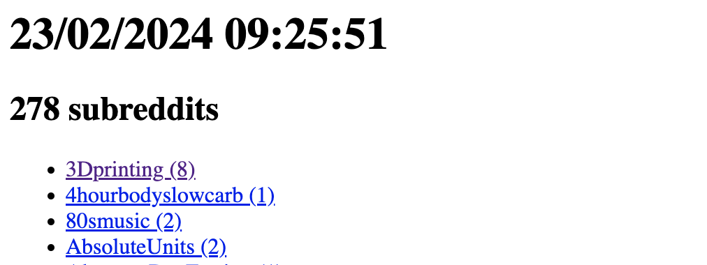

# reddit_organization
A python script that organizes all your saved comments and posts into a simple set of html files.

Based on reddit api's
* https://www.reddit.com/dev/api/

The primary file `index.html` lists all subreddits where a comment or post is saved with a link to a file listing the 
title of the post saved or comment saved in it.

Run this in a cron job where you place the generated files as static content in a web server.

## Why
It's an easy way to get an overview of all your saved posts and comments across your subreddits

## index.html (sample)


## subreddit (sample)


# To Run
(I'm not a python expert)

There are several dependencies needed to run. I generally create a virtual environment for the 
project I'm working. Dependencies
* praw
* pandas
* datetime
* os
* argparse

## Step 1
Set environment variables needed by reddit
```shell
CLIENT_ID=****
CLIENT_SECRET=****
USERNAME=****
PASSWORD=****
```

## Step 2
The script takes one argument which is the folder to save the generated content 

```shell
$ main.py <folder to save generated files>
```
